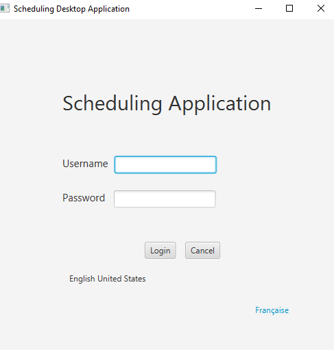
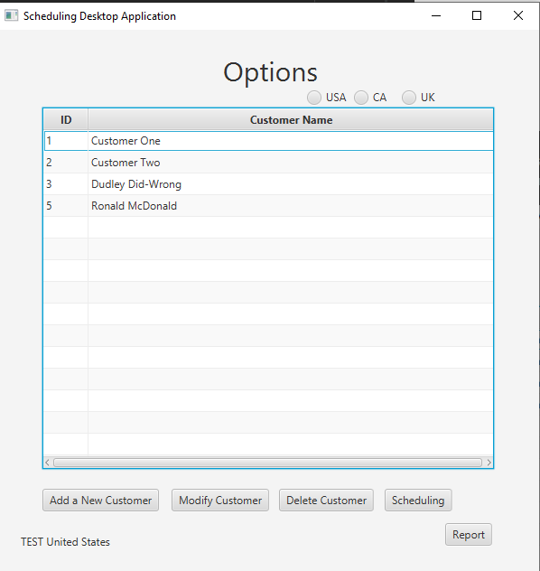
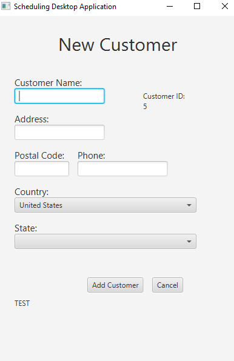
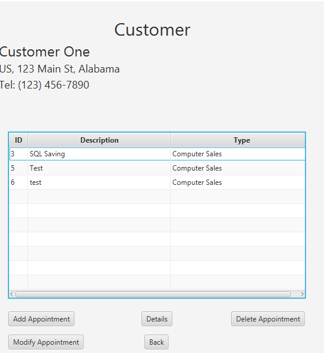
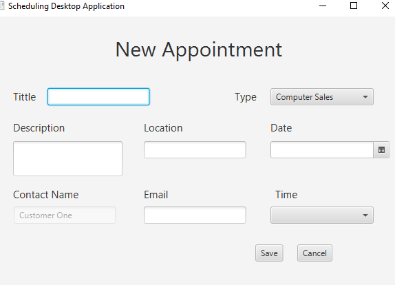
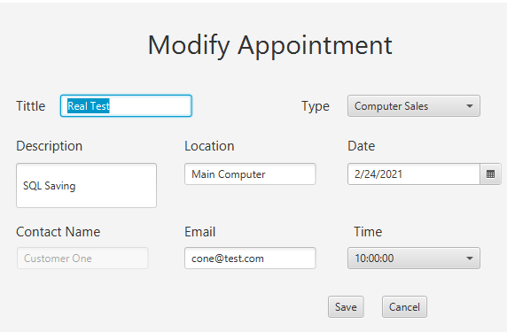
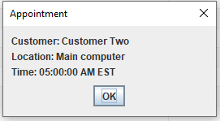
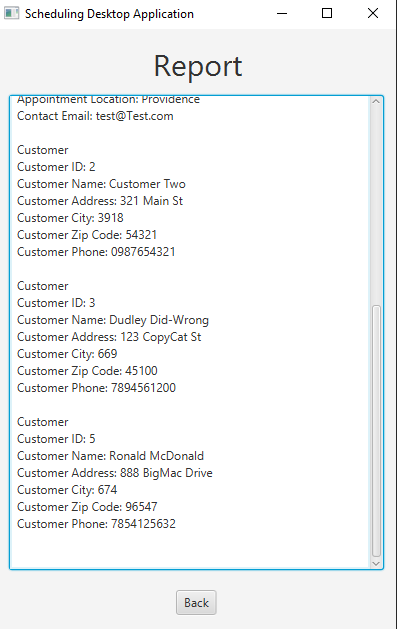

## **Scheduling Desktop App**

This application allows the user to add a new customer and collect of the information needed to contact the customer,
then the user can add an appointment for services. 

Author: Fernando Rosa, frosa1@wgu.edu

Version: 1.0

Date: 3/15/2021

IntelliJ IDEA 2020.3.2 (Community Edition)
Build #IC-203.7148.57, built on January 25, 2021
Runtime version: 11.0.9.1+11-b1145.77 amd64
VM: OpenJDK 64-Bit Server VM by JetBrains s.r.o.

To use the application you will need to login

Username: test
Password: test

On this screen you can select a language also it takes the language of your system.

After logged in at the screen you can add costumers, modify the selected customer, add an appointment to the selected customer,
or delete a customer(to delete the customer all the appointments belonging to the customer need to be deleted first).

Adding a new customer all the information need to be added properly then click "Add Customer".

Modifying an existing customer, the application prepopulate the customer's info. Modify it and save the customer.

Scheduling Appointments allows you to view the customer's appointments, add a new one, modify an existing one, 
see the details of the appointment, or delete appointments.

To add an appointment make sure all the information is filled up properly.

Modifying an existing appointment, the application prepopulate the appointment's info. Modify it and save the appointment.

Appointment's details

Report

A3f

MySQL Connector driver version: mysql-connector-java-8.0.19

When I was working with the Database I found an error that did not allow me to delete one of my entries from the 
database, it was telling me that I was using a foring key. Now I think the error went away, I just noticed it just in case.